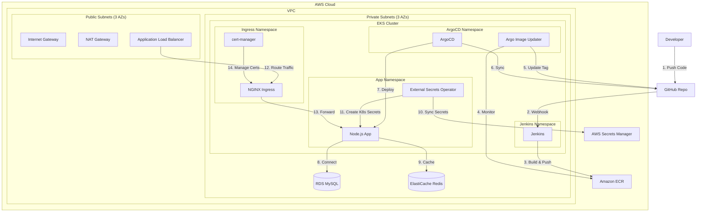

# Design Document

## Overview

This project implements a complete GitOps pipeline on AWS with the following architecture:
- **Infrastructure Layer**: Terraform-managed AWS resources (VPC, EKS, RDS, ElastiCache, ECR)
- **CI Layer**: Jenkins running in EKS for building and pushing Docker images
- **CD Layer**: ArgoCD with Argo Image Updater for GitOps-based deployments
- **Security Layer**: External Secrets Operator syncing AWS Secrets Manager to Kubernetes
- **Application Layer**: Node.js web app with MySQL (RDS) and Redis (ElastiCache)
- **Ingress Layer**: NGINX Ingress Controller with cert-manager for HTTPS

## Architecture



## Components and Interfaces

### 1. Terraform Infrastructure Modules

#### 1.1 VPC Module
**Purpose**: Create network infrastructure with public and private subnets

**Inputs**:
- `vpc_cidr`: CIDR block for VPC (e.g., "10.0.0.0/16")
- `availability_zones`: List of AZs (e.g., ["us-east-1a", "us-east-1b", "us-east-1c"])
- `public_subnet_cidrs`: List of CIDR blocks for public subnets
- `private_subnet_cidrs`: List of CIDR blocks for private subnets

**Outputs**:
- `vpc_id`: VPC identifier
- `public_subnet_ids`: List of public subnet IDs
- `private_subnet_ids`: List of private subnet IDs
- `nat_gateway_id`: NAT Gateway identifier

**Resources**:
- VPC with DNS support enabled
- 3 public subnets with auto-assign public IP
- 3 private subnets
- Internet Gateway attached to VPC
- NAT Gateway in one public subnet with Elastic IP
- Route table for public subnets (route to IGW)
- Route table for private subnets (route to NAT)

#### 1.2 EKS Module
**Purpose**: Provision Amazon EKS cluster with managed node groups

**Inputs**:
- `cluster_name`: Name of the EKS cluster
- `cluster_version`: Kubernetes version (e.g., "1.28")
- `vpc_id`: VPC ID from VPC module
- `private_subnet_ids`: Private subnet IDs for node groups
- `node_instance_types`: List of EC2 instance types (e.g., ["t3.medium"])
- `node_desired_size`: Desired number of nodes
- `node_min_size`: Minimum number of nodes
- `node_max_size`: Maximum number of nodes

**Outputs**:
- `cluster_id`: EKS cluster identifier
- `cluster_endpoint`: EKS API server endpoint
- `cluster_certificate_authority_data`: CA certificate for cluster
- `cluster_security_group_id`: Security group ID for cluster
- `node_security_group_id`: Security group ID for nodes
- `oidc_provider_arn`: OIDC provider ARN for IRSA

**Resources**:
- EKS cluster with private endpoint access
- IAM role for EKS cluster with required policies
- Managed node group in private subnets
- IAM role for node group with required policies
- OIDC provider for IAM Roles for Service Accounts (IRSA)
- Security group rules for cluster-to-node communication

#### 1.3 RDS Module
**Purpose**: Provision RDS MySQL instance for application data

**Inputs**:
- `db_name`: Database name
- `db_username`: Master username
- `db_password`: Master password (from variables, will be stored in Secrets Manager)
- `vpc_id`: VPC ID
- `private_subnet_ids`: Private subnet IDs for DB subnet group
- `allowed_security_group_ids`: Security groups allowed to access RDS (EKS node SG)
- `instance_class`: RDS instance type (e.g., "db.t3.micro")
- `allocated_storage`: Storage size in GB
- `engine_version`: MySQL version (e.g., "8.0")

**Outputs**:
- `db_endpoint`: RDS endpoint hostname
- `db_port`: RDS port (3306)
- `db_name`: Database name
- `db_secret_arn`: ARN of secret in Secrets Manager

**Resources**:
- RDS MySQL instance with multi-AZ deployment
- DB subnet group spanning private subnets
- Security group allowing MySQL traffic from EKS nodes
- AWS Secrets Manager secret storing connection details
- Parameter group for MySQL configuration

#### 1.4 ElastiCache Module
**Purpose**: Provision ElastiCache Redis cluster for caching

**Inputs**:
- `cluster_id`: Redis cluster identifier
- `vpc_id`: VPC ID
- `private_subnet_ids`: Private subnet IDs for subnet group
- `allowed_security_group_ids`: Security groups allowed to access Redis (EKS node SG)
- `node_type`: Cache node type (e.g., "cache.t3.micro")
- `num_cache_nodes`: Number of cache nodes
- `engine_version`: Redis version (e.g., "7.0")

**Outputs**:
- `redis_endpoint`: Redis primary endpoint
- `redis_port`: Redis port (6379)
- `redis_secret_arn`: ARN of secret in Secrets Manager

**Resources**:
- ElastiCache Redis cluster
- Subnet group spanning private subnets
- Security group allowing Redis traffic from EKS nodes
- AWS Secrets Manager secret storing connection details

#### 1.5 ECR Module
**Purpose**: Create ECR repository for Docker images

**Inputs**:
- `repository_name`: Name of ECR repository

**Outputs**:
- `repository_url`: ECR repository URL
- `repository_arn`: ECR repository ARN

**Resources**:
- ECR repository with image scanning enabled
- Lifecycle policy to retain last 10 images
- Repository policy allowing EKS nodes to pull images

### 2. Node.js Application

#### 2.1 Application Structure
```
nodejs-app/
├── src/
│   ├── index.js          # Express server entry point
│   ├── config/
│   │   ├── database.js   # MySQL connection configuration
│   │   └── redis.js      # Redis connection configuration
│   ├── routes/
│   │   └── api.js        # API endpoints
│   └── middleware/
│       └── cache.js      # Redis caching middleware
├── Dockerfile
├── package.json
└── .dockerignore
```

#### 2.2 Database Connection (MySQL)
**Configuration**:
- Host: From environment variable `DB_HOST`
- Port: From environment variable `DB_PORT` (default: 3306)
- Database: From environment variable `DB_NAME`
- Username: From environment variable `DB_USER`
- Password: From environment variable `DB_PASSWORD`

**Connection Pool**:
- Use `mysql2` library with promise support
- Connection pool with min 2, max 10 connections
- Connection timeout: 10 seconds
- Automatic reconnection enabled

#### 2.3 Redis Connection
**Configuration**:
- Host: From environment variable `REDIS_HOST`
- Port: From environment variable `REDIS_PORT` (default: 6379)

**Client Setup**:
- Use `redis` library (node-redis v4)
- Automatic reconnection with exponential backoff
- Connection timeout: 5 seconds
- Default TTL for cached items: 300 seconds (5 minutes)

#### 2.4 API Endpoints

**GET /health**
- Returns application health status
- Checks MySQL and Redis connectivity
- Response: `{ status: "healthy", mysql: "connected", redis: "connected" }`

**POST /api/items**
- Creates a new item in MySQL
- Request body: `{ name: string, description: string }`
- Invalidates cache for items list
- Response: `{ id: number, name: string, description: string }`

**GET /api/items/:id**
- Retrieves item by ID
- First checks Redis cache
- If not cached, queries MySQL and stores in Redis
- Response: `{ id: number, name: string, description: string, cached: boolean }`

**GET /api/items**
- Lists all items
- Uses Redis caching with 5-minute TTL
- Response: `{ items: [...], cached: boolean }`

#### 2.5 Dockerfile
```dockerfile
FROM node:18-alpine
WORKDIR /app
COPY package*.json ./
RUN npm ci --only=production
COPY src/ ./src/
EXPOSE 3000
CMD ["node", "src/index.js"]
```

### 3. Jenkins CI Pipeline

#### 3.1 Jenkins Installation
**Helm Chart**: `jenkins/jenkins`
**Namespace**: `jenkins`

**Values Configuration**:
- Persistence enabled with 20Gi PVC
- Service type: ClusterIP
- Install required plugins:
  - kubernetes
  - docker-workflow
  - git
  - pipeline-aws
  - amazon-ecr

**IRSA Configuration**:
- Create IAM role for Jenkins service account
- Attach policy for ECR push permissions
- Annotate service account with IAM role ARN

#### 3.2 Jenkinsfile Pipeline Stages

**Stage 1: Checkout**
- Clone application repository
- Checkout specific branch/commit

**Stage 2: Build Docker Image**
- Build image using Dockerfile
- Tag with Git commit SHA and "latest"
- Format: `<ecr-url>/<repo-name>:<commit-sha>`

**Stage 3: Push to ECR**
- Authenticate with ECR using AWS credentials
- Push image with commit SHA tag
- Push image with "latest" tag

**Stage 4: Notify**
- Send build status notification
- Log image details for verification

### 4. ArgoCD GitOps

#### 4.1 ArgoCD Installation
**Helm Chart**: `argo/argo-cd`
**Namespace**: `argocd`

**Values Configuration**:
- Server service type: ClusterIP (accessed via Ingress)
- Enable metrics
- Configure repository credentials for private repos

#### 4.2 Application Manifest Repository Structure
```
k8s-manifests/
├── application/
│   ├── deployment.yaml
│   ├── service.yaml
│   ├── configmap.yaml
│   └── externalsecret.yaml
└── argocd/
    └── application.yaml
```

#### 4.3 ArgoCD Application Resource
```yaml
apiVersion: argoproj.io/v1alpha1
kind: Application
metadata:
  name: nodejs-app
  namespace: argocd
spec:
  project: default
  source:
    repoURL: <git-repo-url>
    targetRevision: main
    path: application
  destination:
    server: https://kubernetes.default.svc
    namespace: app
  syncPolicy:
    automated:
      prune: true
      selfHeal: true
    syncOptions:
      - CreateNamespace=true
```

#### 4.4 Argo Image Updater Installation
**Helm Chart**: `argo/argocd-image-updater`
**Namespace**: `argocd`

**Configuration**:
- Monitor ECR repository for new images
- Update strategy: latest tag or semver
- Write-back method: Git commit
- Git credentials configured via secret

**Annotation on Application**:
```yaml
annotations:
  argocd-image-updater.argoproj.io/image-list: nodejs-app=<ecr-url>/<repo-name>
  argocd-image-updater.argoproj.io/nodejs-app.update-strategy: latest
  argocd-image-updater.argoproj.io/write-back-method: git
```

### 5. External Secrets Operator

#### 5.1 ESO Installation
**Helm Chart**: `external-secrets/external-secrets`
**Namespace**: `external-secrets-system`

**IRSA Configuration**:
- Create IAM role for ESO service account
- Attach policy for Secrets Manager read access
- Annotate service account with IAM role ARN

#### 5.2 SecretStore Resource
```yaml
apiVersion: external-secrets.io/v1beta1
kind: SecretStore
metadata:
  name: aws-secrets-manager
  namespace: app
spec:
  provider:
    aws:
      service: SecretsManager
      region: us-east-1
      auth:
        jwt:
          serviceAccountRef:
            name: external-secrets-sa
```

#### 5.3 ExternalSecret for RDS
```yaml
apiVersion: external-secrets.io/v1beta1
kind: ExternalSecret
metadata:
  name: rds-credentials
  namespace: app
spec:
  refreshInterval: 5m
  secretStoreRef:
    name: aws-secrets-manager
    kind: SecretStore
  target:
    name: rds-secret
    creationPolicy: Owner
  data:
    - secretKey: DB_HOST
      remoteRef:
        key: <rds-secret-name>
        property: host
    - secretKey: DB_PORT
      remoteRef:
        key: <rds-secret-name>
        property: port
    - secretKey: DB_NAME
      remoteRef:
        key: <rds-secret-name>
        property: dbname
    - secretKey: DB_USER
      remoteRef:
        key: <rds-secret-name>
        property: username
    - secretKey: DB_PASSWORD
      remoteRef:
        key: <rds-secret-name>
        property: password
```

#### 5.4 ExternalSecret for Redis
```yaml
apiVersion: external-secrets.io/v1beta1
kind: ExternalSecret
metadata:
  name: redis-credentials
  namespace: app
spec:
  refreshInterval: 5m
  secretStoreRef:
    name: aws-secrets-manager
    kind: SecretStore
  target:
    name: redis-secret
    creationPolicy: Owner
  data:
    - secretKey: REDIS_HOST
      remoteRef:
        key: <redis-secret-name>
        property: host
    - secretKey: REDIS_PORT
      remoteRef:
        key: <redis-secret-name>
        property: port
```

### 6. Application Deployment Manifests

#### 6.1 Deployment
```yaml
apiVersion: apps/v1
kind: Deployment
metadata:
  name: nodejs-app
  namespace: app
spec:
  replicas: 3
  selector:
    matchLabels:
      app: nodejs-app
  template:
    metadata:
      labels:
        app: nodejs-app
    spec:
      serviceAccountName: nodejs-app-sa
      containers:
      - name: nodejs-app
        image: <ecr-url>/<repo-name>:latest
        ports:
        - containerPort: 3000
        envFrom:
        - secretRef:
            name: rds-secret
        - secretRef:
            name: redis-secret
        livenessProbe:
          httpGet:
            path: /health
            port: 3000
          initialDelaySeconds: 30
          periodSeconds: 10
        readinessProbe:
          httpGet:
            path: /health
            port: 3000
          initialDelaySeconds: 10
          periodSeconds: 5
        resources:
          requests:
            memory: "128Mi"
            cpu: "100m"
          limits:
            memory: "256Mi"
            cpu: "200m"
```

#### 6.2 Service
```yaml
apiVersion: v1
kind: Service
metadata:
  name: nodejs-app
  namespace: app
spec:
  selector:
    app: nodejs-app
  ports:
  - protocol: TCP
    port: 80
    targetPort: 3000
  type: ClusterIP
```

### 7. Ingress and HTTPS

#### 7.1 NGINX Ingress Controller Installation
**Helm Chart**: `ingress-nginx/ingress-nginx`
**Namespace**: `ingress-nginx`

**Values Configuration**:
- Service type: LoadBalancer (creates AWS ALB)
- Enable metrics
- Configure AWS Load Balancer annotations

#### 7.2 cert-manager Installation
**Helm Chart**: `jetstack/cert-manager`
**Namespace**: `cert-manager`

**Values Configuration**:
- Install CRDs
- Enable webhook

#### 7.3 ClusterIssuer for Let's Encrypt
```yaml
apiVersion: cert-manager.io/v1
kind: ClusterIssuer
metadata:
  name: letsencrypt-prod
spec:
  acme:
    server: https://acme-v02.api.letsencrypt.org/directory
    email: <your-email>
    privateKeySecretRef:
      name: letsencrypt-prod
    solvers:
    - http01:
        ingress:
          class: nginx
```

#### 7.4 Ingress Resource
```yaml
apiVersion: networking.k8s.io/v1
kind: Ingress
metadata:
  name: nodejs-app
  namespace: app
  annotations:
    cert-manager.io/cluster-issuer: letsencrypt-prod
    nginx.ingress.kubernetes.io/ssl-redirect: "true"
spec:
  ingressClassName: nginx
  tls:
  - hosts:
    - <your-domain>
    secretName: nodejs-app-tls
  rules:
  - host: <your-domain>
    http:
      paths:
      - path: /
        pathType: Prefix
        backend:
          service:
            name: nodejs-app
            port:
              number: 80
```

## Data Models

### MySQL Database Schema

**Table: items**
```sql
CREATE TABLE items (
  id INT AUTO_INCREMENT PRIMARY KEY,
  name VARCHAR(255) NOT NULL,
  description TEXT,
  created_at TIMESTAMP DEFAULT CURRENT_TIMESTAMP,
  updated_at TIMESTAMP DEFAULT CURRENT_TIMESTAMP ON UPDATE CURRENT_TIMESTAMP
);
```

### Redis Cache Keys

**Pattern**: `item:<id>` - Stores individual item data
**Pattern**: `items:all` - Stores list of all items
**TTL**: 300 seconds (5 minutes)

## Error Handling

### Application Level
- Database connection failures: Retry with exponential backoff, return 503 if unavailable
- Redis connection failures: Log warning, continue without caching, return 200
- Invalid requests: Return 400 with error message
- Not found: Return 404 with error message
- Server errors: Return 500 with generic message, log detailed error

### Infrastructure Level
- EKS node failures: Auto Scaling Group replaces unhealthy nodes
- RDS failures: Multi-AZ automatic failover
- ElastiCache failures: Automatic node replacement
- Pod failures: Kubernetes restarts pods based on liveness probes

### CI/CD Level
- Build failures: Jenkins marks build as failed, sends notification
- Push failures: Retry ECR push up to 3 times
- Deployment failures: ArgoCD marks sync as failed, retains previous version
- Certificate failures: cert-manager retries ACME challenge

## Testing Strategy

### Phase 1: Infrastructure Testing
1. Verify VPC, subnets, and routing tables created
2. Verify EKS cluster accessible via kubectl
3. Verify RDS instance accessible from EKS nodes
4. Verify ElastiCache accessible from EKS nodes
5. Verify ECR repository created

### Phase 2: Application Testing
1. Build Docker image locally
2. Test MySQL connection with sample data
3. Test Redis caching functionality
4. Verify health endpoint returns correct status
5. Test all API endpoints

### Phase 3: Jenkins Testing
1. Verify Jenkins accessible and running
2. Create and run test pipeline
3. Verify image built and pushed to ECR
4. Check ECR for pushed images

### Phase 4: ArgoCD Testing
1. Verify ArgoCD accessible and running
2. Create ArgoCD application
3. Verify application synced and deployed
4. Check pods running in app namespace
5. Test application endpoints

### Phase 5: Image Updater Testing
1. Push new image to ECR
2. Verify Image Updater detects new image
3. Verify Git repository updated with new tag
4. Verify ArgoCD syncs and deploys new version

### Phase 6: External Secrets Testing
1. Verify ESO installed and running
2. Create SecretStore and ExternalSecrets
3. Verify Kubernetes secrets created
4. Verify application can read secrets
5. Update secret in AWS Secrets Manager and verify sync

### Phase 7: Ingress Testing
1. Verify NGINX Ingress Controller running
2. Verify cert-manager running
3. Create Ingress resource
4. Verify Load Balancer created
5. Verify certificate issued
6. Test HTTPS access to application

## Implementation Phases

### Phase 1: Terraform Infrastructure (Requirements 1)
- Set up Terraform project structure
- Implement VPC module
- Implement EKS module
- Implement RDS module
- Implement ElastiCache module
- Implement ECR module
- Create root module to tie everything together
- Apply Terraform and verify resources

### Phase 2: Node.js Application (Requirements 2)
- Create Node.js application structure
- Implement MySQL connection and queries
- Implement Redis caching
- Create API endpoints
- Create Dockerfile
- Test application locally with Docker

### Phase 3: Jenkins CI (Requirements 3)
- Install Jenkins via Helm
- Configure IRSA for ECR access
- Create Jenkinsfile
- Set up Jenkins pipeline
- Test build and push to ECR

### Phase 4: ArgoCD Setup (Requirements 4, 5)
- Install ArgoCD via Helm
- Install Argo Image Updater
- Create Kubernetes manifests repository
- Create ArgoCD Application resource
- Configure Image Updater annotations
- Test GitOps deployment flow

### Phase 5: External Secrets (Requirements 6)
- Install External Secrets Operator
- Configure IRSA for Secrets Manager access
- Create SecretStore resource
- Create ExternalSecret resources
- Verify secrets synced to Kubernetes

### Phase 6: Ingress and HTTPS (Requirements 7)
- Install NGINX Ingress Controller
- Install cert-manager
- Create ClusterIssuer
- Create Ingress resource
- Verify HTTPS access

### Phase 7: Documentation (Requirements 8)
- Create comprehensive README
- Document architecture
- Document setup instructions
- Document CI/CD flow
- Create troubleshooting guide
